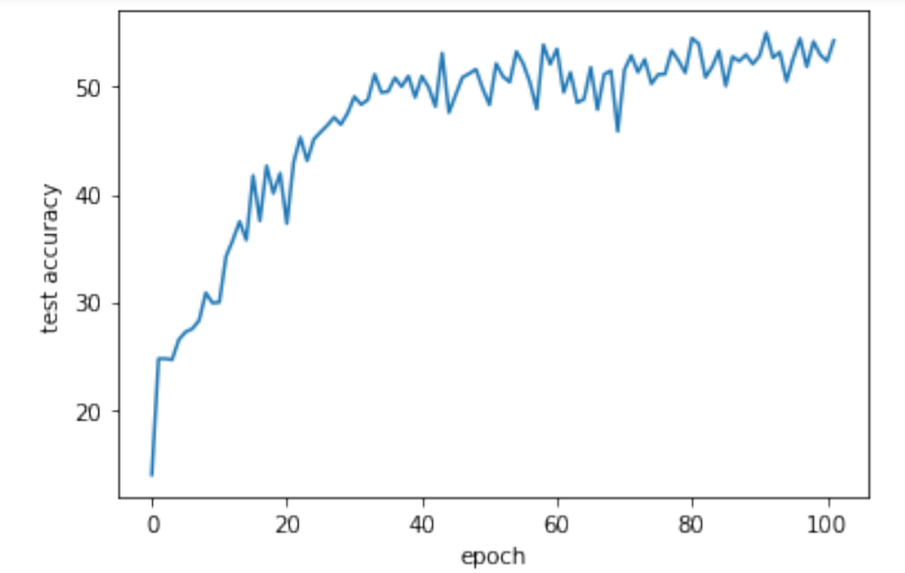

# Emojify

TODO: -- video --

# Abstract
Emojis are images and icons which allow us to express nonverbal emotions. They have become an integral part of online messaging, chatting, product review, brand expression, and more. However, emoji-driven storytelling has still remained a relatively unexplored portion of data science research, despite the numerous applications. With advancements in computer vision and deep learning, we are increasing our abilities to detect human emotions from images. In this project, I detect and classify human facial expressions in order to map them to corresponding emojis. This then allows facial expressions to be replaced by their corrosponding emojis in real time. 

# Dataset
This project was built based on the [FER-2013 dataset](https://www.kaggle.com/msambare/fer2013?). This dataset consists of 35,888 images, each of which is a 48 x 48 grayscale face. The images are all centered and the faces occupy a roughly equal amount of space. The images are then mapped to 7 distinct classes representing the portrayed emotions:

- angry
- disgust
- feat
- happy
- sad
- surprise
- natural

An important factor to note about this dataset is that its very hard - the average human accuracy is only 65.5%. Part of this is due to the 1-channel nature of the data since the loss of color makes it harder to determine certain emotions (such as the lack of reddening for anger). Additionally, the dataset suffers from a lack of noise which leads to high levels of overfitting. Both these factors and others were difficult obstacles that I had to overcome during my project.

# Related Work
Although there has been a lot of various work and research done on emotion detection, there wasn't much in place for a full pipeline of emotion detection to emoji selection. Although I did find some sources such as [FaceEmoji](https://github.com/angelvillar96/FaceEmoji
) and [Facial-Emoji-Recognition](https://yagnikbavishi004.medium.com/emojify-using-face-recognition-with-machine-learning-b6b6f8f339c4
) which I took inspiration from, most of the end design was of my own construction.

I did also look into different models and designs for overall emotion detection on FER-2013. In particular, I took most of my design's inspiration from [this paper](https://arxiv.org/ftp/arxiv/papers/2105/2105.03588.pdf
), which trained a variation of VGGNet with various optimization methods to achieve a 73.28% accuracy on the dataset.

# Methodology
Due to the nature of the problem, I knew that my solution would come at least partially in the form of a CNN. Consequentially, I began with a basic CNN model and began experimenting with various designs. However, I quickly encountered a difficult problem with the dataset that would plague me throughout the project. There appeared to be a local minimum at around 25% accuracy that many of my different models kept converging to. Tuning hyperparameters had little to no effect on this, and even drastically resturcuring the overall network design led to little improvement. Eventually, after conducting more research into emotion recognition and reading through various papers I adopted a variation of VGGNet as my base structure. This began performing slightly better, but there was still huge variations in training that was resulting in little success.

By this point, I had two main issues with the model training that I needed to overcome. Firstly, the model was heavily overfitting. By this point my best model had an accuracy of 34%, with a training loss of 0.6977 and a test loss of 2.4902 (after 20 iterations). Secondly, I had huge variations in training that resulted in large spikes in loss and accuracy. To fix these issues, I began adding noise into the dataset. This included resizing the images by up to ± 20%, rotating the images by up to 20 degrees, randomly flipping the images across the y-axis, randomly cropping them down to a 40*40 image with 4 pixels of added padding, and finally normalizing the overall image. This resulted in a huge boost to performance, finally reducing the large spikes I had been struggling to deal with during training. 

Finally, I tuned various hyperparameters (weight decay, momentum, learning rate, etc.) to optimize the results. However, the biggest issue which I ran into during this stage and the previous ones was training time. Since emotion detection is a complex issue, the end network was the largest model I'd ever tried to train. Consequently, training took a very long time - whereas the aforementioned paper ran their models for 300 epochs it took me almost 3 hours just to run 100. This resulted me in using a relatively high learning rate just to get the training done in time, even though this then led to less smoothness in training.

# Experiments / Evaluation
In the end, my model achieved a final test accuracy of 54%. I wasn't overall that happy with this, and had been hoping for the model to perform better, but seeing as how the average human accuracy is only 65.5% and the current best model performance is 73.28% I thought the result was relatively alright. Had I had more time, I would have improved my results by using a lower learning rate to smoothen out the training and used a larger network structure so as to lessen the effects of overfitting.

Final train loss: 0.8953868140254104 \
Final test loss:  1.2624089059207924

Final Accuracy vs. Epoch:

# Results

Here are some of the results after hooking up the model with real-time facial detection and replacement technology:

